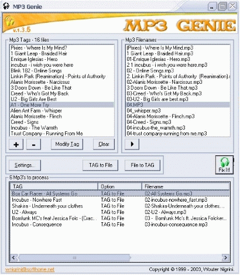



## Mp3 Genie

### Description

Mp3 Genie will fix all your mp3 filenames to be equal to the mp3 TAG. You can also change the mp3 TAGs in this program. The source code also shows how to open multiple files with the common dialog control and how to change the colors of the progressbar control. CHECK OUT FOR THE NEXT VERSION WHICH WILL GIVE YOU THE OPTION TO GROUP MP3S IN ARTIST FOLDERS AND CODE WILL BE COMMENTED MORE. Also please vote for me!
 
### More Info
 
Known bug FIXED!!!

             |
---                |---
**Submitted On**   |2003-08-16 23:43:08
**By**             |[WouterNigrini](https://github.com/Planet-Source-Code/PSCIndex/blob/master/ByAuthor/wouternigrini.md)
**Level**          |Advanced
**User Rating**    |4.4 (31 globes from 7 users)
**Compatibility**  |VB 6\.0
**Category**       |[Sound/MP3](https://github.com/Planet-Source-Code/PSCIndex/blob/master/ByCategory/sound-mp3__1-45.md)
**World**          |[Visual Basic](https://github.com/Planet-Source-Code/PSCIndex/blob/master/ByWorld/visual-basic.md)
**Archive File**   |[Mp3\_Genie1631348172003\.zip](https://github.com/Planet-Source-Code/wouternigrini-mp3-genie__1-47778/archive/master.zip)

